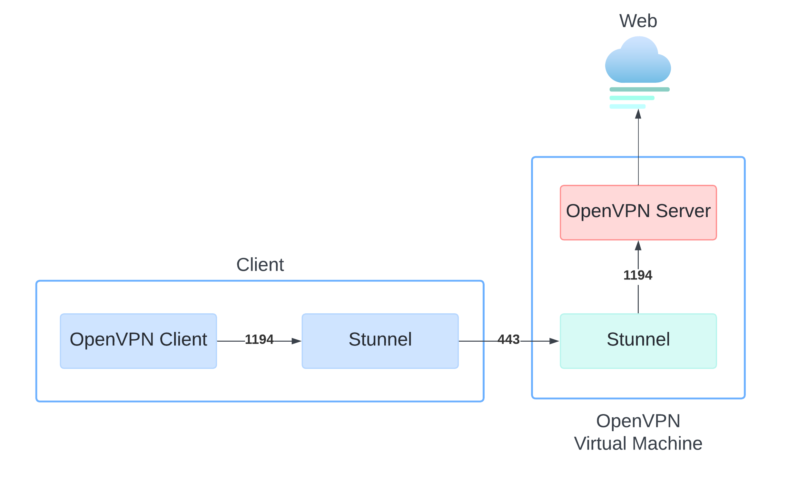

# OpenVPN Builder
- [Overview](#overview)
    - [Limitations](#limitations)
- [Setup](#setup)
    - [Ansible](#ansible)
    - [Terraform](#terraform)
    - [Client](#client)
    - [Steps Summary](#steps-summary)
- [References](#references)

This repo automates setting up your own personal OpenVPN server, using Terraform to spin up the VM and Ansible to handle the installation and configuration of OpenVPN and Stunnel (executed by Terraform).

## Overview


Using Stunnel with OpenVPN adds an extra layer of encryption and enhances compatibility by tunneling traffic through SSL/TLS on port 443, here’s how the setup works:

1. Stunnel container on your machine listens on port `1194` and forwards OpenVPN client traffic to the Stunnel server on the VPN server over port `443`.
2. The Stunnel server decrypts the traffic and forwards it to the OpenVPN server running on the same machine, also on port `1194`.
3. Once connected, your traffic is routed through the VPN, allowing you to browse the web securely.

### Limitations
Stunnel uses SSL, which only works over TCP ([reference](https://www.stunnel.org/faq.html)). This means OpenVPN has to run on TCP too, TCP's error-checking and retransmission mechanisms can increase latency, making it less suitable for real-time applications compared to OpenVPN's native UDP mode.

## Setup
Be sure you have the following installed before proceeding:
- Terraform
- Azure CLI
- Ansible
- Docker
- Docker Compose
- OpenVPN

### Ansible
The playbook runs two roles: Stunnel and OpenVPN. It’s triggered by Terraform but can also be run directly on an existing VM if you prefer. The Stunnel role installs Stunnel and generates a self-signed certificate and key, while the OpenVPN role installs OpenVPN and EasyRSA for PKI, creates all necessary certificates and keys, and configures the OpenVPN server. The setup works out of the box but can be customized using these variables:
```
openvpn_port: "1194"
openvpn_proto: tcp
openvpn_dns: "1.1.1.1"
openvpn_subnet: "10.8.0.0"
openvpn_netmask: "255.255.255.0"
```

Finally, the playbook downloads the `client.ovpn` file to the repo's client directory, ready for connecting to the OpenVPN server via the Stunnel client Docker Compose setup using `connect.sh` script.

### Terraform
Terraform sets up the basics: It creates a VM with a virtual network, public IP, and all the essentials. Once the VM is ready, it triggers Ansible to handle the heavy lifting, taking care of configuration and setup.

The current Terraform code provisions a VM in Azure, with plans to expand support for other cloud providers in the future such as AWS and GCP.

First, login with your Azure account using `az login` then create `terraform.tfvars` with the following:
```
public_key_path   = "/path/to/key"
subscription_id   = "your-subscription-id"
```

### Client
Once the VM is set up with the Ansible playbook (automatically executed by Terraform if used), you’ll find a `client.ovpn` file in the repo’s clients directory. Run the connect.sh script, which:

1. Adds a route (`ip route add $SERVER_IP/32 via $GATEWAY`) which ensures your traffic to the VPN server bypasses the VPN tunnel.
2. Updates the stunnel.conf file in the client directory with the Azure VM's public IP, pulled directly from Terraform's output.
3. Spins up the Stunnel client using Docker Compose.
4. Connects to the OpenVPN server using the `client.ovpn` file and voila.

When you exit with `CTRL + C`, the script cleans up automatically.

### Steps Summary
1. Login to Azure using Azure CLI: `az login`.
2. Add your public key path and Azure subscription ID in the `terraform.tfvars` file.
3. Execute Terraform to create and configure VM.
4. Connect to the VPN using `connect.sh` script (make sure `client.ovpn` has been downloaded in the clients directory).

## References
- https://docs.edisglobal.com/advanced-setup-guides/openvpn-over-stunnel
- https://devforth.io/blog/setup-openvpn-server-on-ubuntu
- https://docs.ansible.com/ansible/latest/playbook_guide/playbooks_reuse_roles.html
- https://docs.ansible.com/ansible/latest/collections/community/crypto/openssl_privatekey_module.html
- https://docs.ansible.com/ansible/latest/collections/community/crypto/x509_certificate_module.html
